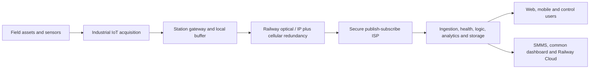
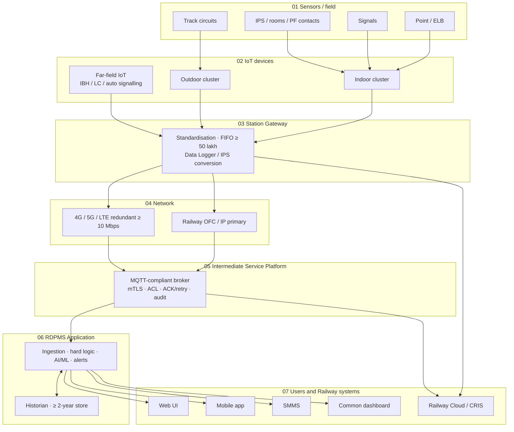
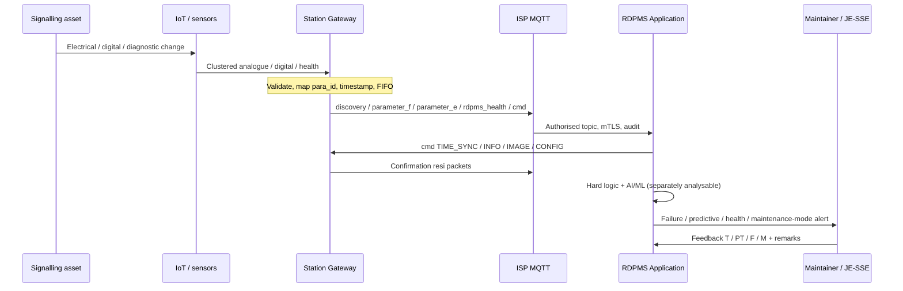
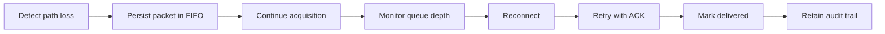
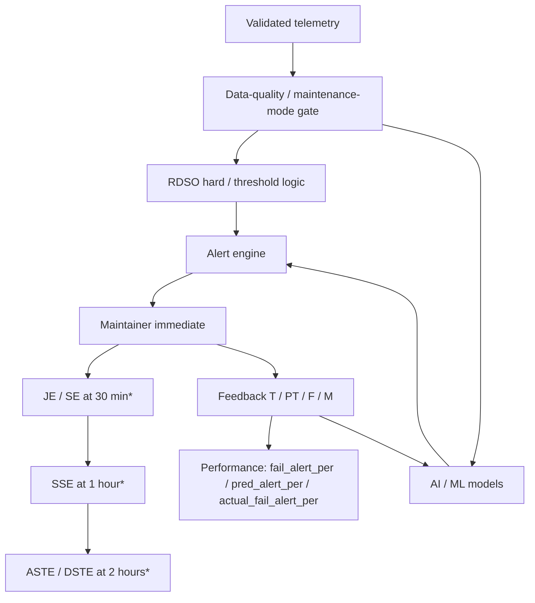
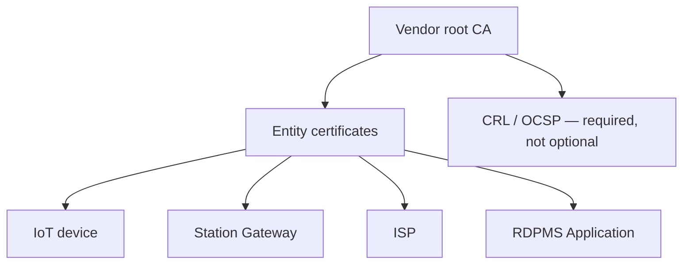
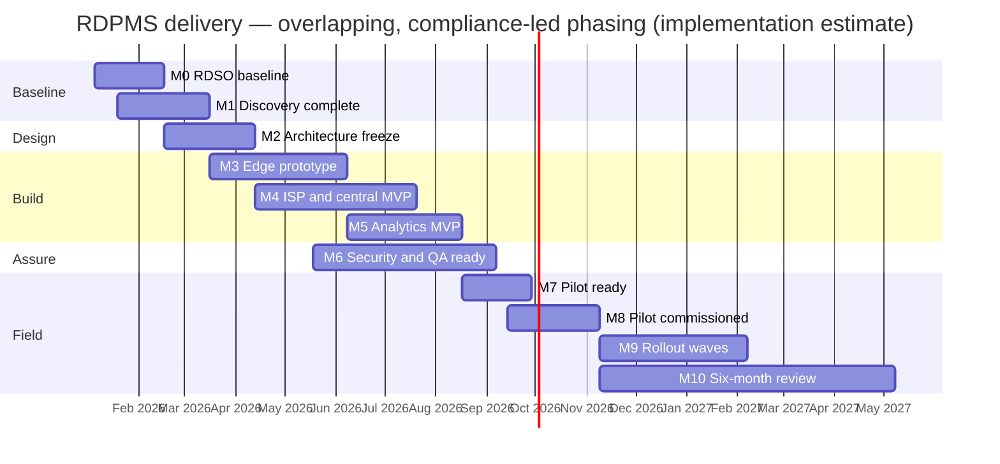

# Indian Railways — RDPMS(S)

## Comprehensive Development Roadmap and Technical Delivery Approach

| Field | Value |
| --- | --- |
| Document | Working Version 2 — expanded for technical / stakeholder review |
| System | Remote Diagnostic and Predictive Maintenance System for Signalling — **RDPMS(S)** |
| Primary authority | **RDSO/SPN/257/2025, Version 2.0**, effective 31.12.2025 (215 pages) |
| Document position | A development roadmap and technical delivery approach. **Not** the final station-specific low-level design. |
| Source of truth | RDSO specification. OEM and station-specific interfaces are **validation dependencies**, not assumptions. |
| Success criterion | A technically defensible, testable and deployable RDPMS whose architecture, interfaces, data model, analytics, security and commissioning evidence can be traced to RDSO requirements. |
| Scope labels used throughout | **Required** · **Site-dependent** · **Future-compatible** |

---

## Contents

1. [Executive summary](#1-executive-summary)
2. [What we are building, and why](#2-what-we-are-building-and-why)
3. [How this document should be read](#3-how-this-document-should-be-read)
4. [RDSO requirement baseline](#4-rdso-requirement-baseline)
5. [Target end-state architecture](#5-target-end-state-architecture)
6. [End-to-end data flow](#6-end-to-end-data-flow)
7. [Station-side technical approach](#7-station-side-technical-approach)
8. [Station Gateway / edge — delivery design](#8-station-gateway--edge--delivery-design)
9. [Standard data model and packet contracts](#9-standard-data-model-and-packet-contracts)
10. [Communication, redundancy and store-and-forward](#10-communication-redundancy-and-store-and-forward)
11. [Central RDPMS platform](#11-central-rdpms-platform)
12. [Failure logic, prediction, alerts and root cause](#12-failure-logic-prediction-alerts-and-root-cause)
13. [API and integration approach](#13-api-and-integration-approach)
14. [Safety and cybersecurity](#14-safety-and-cybersecurity)
15. [Equipment, sizing and survey formulas](#15-equipment-sizing-and-survey-formulas)
16. [Manpower and organisation](#16-manpower-and-organisation)
17. [Critical dependencies](#17-critical-dependencies)
18. [Milestones, phases and delivery gates](#18-milestones-phases-and-delivery-gates)
19. [Workstreams and deliverables](#19-workstreams-and-deliverables)
20. [Proposed Wayam workstream](#20-proposed-wayam-workstream)
21. [Risks and mitigation](#21-risks-and-mitigation)
22. [Test, QA and commissioning](#22-test-qa-and-commissioning)
23. [Pilot and rollout](#23-pilot-and-rollout)
24. [Engineering evidence pack](#24-engineering-evidence-pack)
25. [Immediate next 10 working actions](#25-immediate-next-10-working-actions)
26. [Client-ready executive position](#26-client-ready-executive-position)
27. [Primary RDSO reference points](#27-primary-rdso-reference-points)
28. [Open decisions log](#28-open-decisions-log)

---

## 1. Executive summary

The proposed RDPMS(S) delivery will establish an end-to-end remote diagnostic and predictive-maintenance capability for Indian Railway signalling assets.

The solution will:

- acquire condition and diagnostic information at stations through sensors, IoT devices and existing signalling-system interfaces;
- aggregate and standardise that information through the Station Gateway / edge;
- transport it securely through the Railway communication network and the Intermediate Service Platform (ISP);
- process and store it in the central RDPMS Application;
- apply RDSO-defined deterministic failure / prediction logic together with AI/ML predictive analytics;
- expose actionable information to authorised Railway users through web, mobile and common-dashboard interfaces.

The delivery strategy is staged on purpose:

1. Freeze the RDSO requirement baseline and validate station / OEM interfaces.
2. Freeze architecture and connector contracts.
3. Build and integrate station edge, ISP and central platform.
4. Qualify analytics and security.
5. Execute reference-station commissioning, six-month performance validation and phased rollout.

This is **not** a proof-of-concept product. Required capabilities are delivered as the commissioned system. Site-dependent items wait for survey and purchaser input. Future-compatible items (C-DOT common service platform / oneM2M over MQTT) are preserved in the design and are **not** shown as commissioned.

**Eighteen months** is an implementation estimate for a reference station on an existing approved product/platform, not a mandated RDSO schedule. The schedule is gated by survey, design approval, laboratory assurance, commissioning and six-month performance validation.

---

## 2. What we are building, and why

RDPMS(S) is a **monitoring, diagnostic and predictive-maintenance platform**. It does not control vital signalling. Its purpose is to give remote visibility into the health and behaviour of signalling assets, identify abnormal / failure conditions, predict developing failures where sufficient data exists, and support timely maintenance action.

### 2.1 Functional outcomes

- Continuously acquire relevant signalling-asset parameters and status information.
- Reuse existing Data Logger / IPS / diagnostic information where specified and technically available.
- Create a common, standardised data-exchange layer so station-side and central components remain interoperable across vendors (`vcc` / `vgc`).
- Retain historical information for analysis and the required two-year storage.
- Generate **failure**, **predictive**, **RDPMS-health** and **maintenance-mode** alerts.
- Capture maintainer feedback (`T` / `PT` / `F` / `M`) and evaluate alert and AI/ML performance.
- Provide APIs for SMMS, Railway Cloud / CRIS, and a common management dashboard.
- Operate with a hard boundary from vital signalling control, and with the required security and testing controls.

### 2.2 Why this matters for Indian Railways

| Outcome | Railway value | RDSO anchor |
| --- | --- | --- |
| Remote diagnostics | Reduce mean time to restore by putting cause information in the maintainer’s hands | Spec §2.2 |
| Predictive maintenance | Act before failure, using threshold logic plus models | Spec §2.3, §13 |
| Health of the monitoring chain | Sensors, IoT, gateway and network are themselves alarmed | Spec §2.4 |
| Interoperability | Any vendor gateway can talk to any vendor application through the standard packets | Spec §3.5, §10, Annexure A/B |
| Data custody | Railway retains copies of image and parameter packets | Spec §11.12 |
| Measurable performance | After six months, three alert indicators must exceed 60% | Spec §14 |

---

## 3. How this document should be read

Three labels are used for every capability.

| Label | Meaning | Example |
| --- | --- | --- |
| **Required** | Mandated for every applicable deployment. | Data Logger and IPS protocol conversion; OFC primary + 4G/5G/LTE redundancy; two-year storage; mTLS; CRL/OCSP |
| **Site-dependent** | Selected after station survey and purchaser input. | Field media (wired / optical / wireless); station PC; UPS vs IPS 24 V; optional assets (SPD, block instrument, UFSBI, axle counter) |
| **Future-compatible** | Must not be shown as commissioned. Design must not block it. | C-DOT common service platform and oneM2M over MQTT |

**This document is not a station BOM.** No fixed station quantity schedule can be frozen until the station survey and purchaser inputs (Spec §21) are complete.

**This repository’s website is a design / communication application**, not the operational RDPMS. Firmware, MQTT middleware, backend services, mobile applications, the data platform, the ML pipeline, cybersecurity controls and field commissioning tooling are separate engineering workstreams described here.

---

## 4. RDSO requirement baseline

### 4.1 Confirmed delivery consequences

| Requirement area | RDSO position | Delivery consequence | Status |
| --- | --- | --- | --- |
| Station-to-central connectivity | Railway OFC / IP / MPLS as primary; 4G/5G/LTE redundant; minimum 10 Mbps, subject to station sizing | Network survey and redundancy design are prerequisites to rollout | **RDSO confirmed** |
| Station subsystem interfaces | Indoor systems such as Data Logger, IPS, SSDAC, MSDAC, BPAC, UFSBI, AFTC, ELD may use serial / Ethernet / fibre; redundant path required | Connector catalogue + OEM validation + adapters | **RDSO confirmed / OEM validation** |
| Station Gateway | Collects station data, interfaces with IoT / diagnostic sources, standardises packets, provides edge buffering | Gateway hardware / software LLD and qualification | **RDSO confirmed** |
| Standard data exchange | Gateway ↔ application uses the standard data format and a publish / subscribe model | Canonical schema, packet validation and interoperability tests | **RDSO confirmed** |
| ISP | Secure middleware for bidirectional data / command exchange; MQTT compliant; acknowledgement / retry / encryption / logging / audit / fault tolerance | ISP is a first-class workstream, not hidden in the application backend | **RDSO confirmed** |
| Historian / storage | Application / ISP hosting as decided by Zonal Railway; server storage for at least 2 years | Sizing, archival, backup / restore and DR design | **RDSO confirmed** |
| AI / ML | Predictive maintenance, RUL, hard logic + ML separately analysable; models reviewed by RDSO / Zonal Railways; IP available to Indian Railways | Analytics workstream, model governance and evaluation | **RDSO confirmed** |
| APIs / common dashboard | Standard APIs required; common dashboard may aggregate reports from multiple vendor applications | API contract and integration-test workstream | **RDSO confirmed** |
| Security | Certificate-authenticated TLS; CRL / OCSP; TEC 31318 IoT declaration; STQC safe-to-host; NCCS ITSAR cipher suites | Secure SDLC + testing + evidence pack | **RDSO confirmed** |
| Testing / commissioning | Type, acceptance, routine, environmental, EMI/EMC, pre-commissioning | QA and commissioning gates are built into the roadmap | **RDSO confirmed** |
| Training / warranty | On-site training, manuals, video tutorials; 3-year warranty covering hardware, software, networking accessories, SIM charges where applicable, calibration, and software changes that do not need extra hardware | Training pack and warranty operations | **RDSO confirmed** |

### 4.2 Capability register (page-referenced)

Evidence pages refer to **RDSO/SPN/257/2025 v2.0**.

#### Field sensing and acquisition

| ID | Capability | Status | Spec page |
| --- | --- | --- | --- |
| field-asset-coverage | Survey-driven coverage of point machines, ELB, signals, DC track circuits, and purchaser-selected optional classes | Required (quantities from survey) | 12–14, 33 |
| equipment-room-monitoring | Ambient temperature and humidity for battery, relay and power rooms plus specified outdoor locations | Required | 14 |
| current-sensing | Non-intrusive current sensors; signalling circuit must not be disturbed | Required | 10 |
| voltage-isolation | Prefer non-intrusive voltage. If intrusive: high impedance, galvanic isolation, **2.5 kV for 60 s**, loading ≤ 1 mA per channel | Required | 10 |
| event-sampling | Voltage and current at **≤ 20 ms** during **point-machine / ELB operation only**. Configurable. Not continuous sampling of every channel | Required | 12, 16, 68 |
| sensor-accuracy | IEC 60688 Class 1; current sensors 2% or better; accuracy of the complete sensor system including conditioning and ADC | Required | 11 |
| sensor-drift | Annual calibration; drift **< 2%** per year; on-site recalibration provision | Required | 11 |
| spare-channels | `max(10%, 2)` spare IoT channels at each location | Required | 17 |

#### Edge resilience

| ID | Capability | Status | Spec page |
| --- | --- | --- | --- |
| iot-buffer | IoT stores **≥ 10 lakh** events FIFO; no loss on power or communications failure | Required | 15 |
| gateway-buffer | Gateway stores **≥ 50 lakh** events FIFO; no loss on power or communications failure | Required | 18 |
| resource-headroom | Normal CPU / RAM / storage **≤ 70%**, externally verifiable | Required | 18, 24 |
| field-power | 24 V DC **(+20% / −30%)** from IPS; 110 V AC secondary option; industrial adapter if needed | Required / site-dependent adapter | 15, 19, 22 |
| station-interfaces | Built-in protocol conversion for **Data Logger and IPS**; MSDAC / ELD / others when protocol is made available | Required (extra ports OEM-gated) | 12–13, 17 |
| gateway-time-sync | Application time-sync command; GPS / **IRNSS** fallback when network or API NTP is unavailable; IoT syncs from gateway | Required | 20, 67–68 |
| iot-health | Periodic IoT and sensor health to gateway, then to application | Required | 15 |

#### Network

| ID | Capability | Status | Spec page |
| --- | --- | --- | --- |
| station-uplinks | Railway optical / IP **primary**; **mandatory** 4G/5G/LTE in parallel; **≥ 10 Mbps** (Zonal Railway may increase) | Required | 22 |
| local-media | IoT ↔ gateway: quad / PIJF / dark fibre and/or 4G/5G/LTE; short-range wireless (LoRa, Zigbee, licence-free) as site requires | Site-dependent | 20 |
| indoor-redundancy | Indoor interlocking subsystems ↔ gateway: RS232 / RS485, RJ45, LC fibre; redundant wired / wireless path | Required | 22 |
| system-health | Continuously monitor sensors, IoT, gateway and network; alert on failure | Required | 7 |

#### Platform, applications and integrations

| ID | Capability | Status | Spec page |
| --- | --- | --- | --- |
| publish-subscribe | Standard packets over MQTT-compliant ISP | Required | 23, 69–72 |
| railway-cloud | **Image packets and parameter packets** copied to Railway Cloud (CRIS or as decided) from gateway, ISP or application | Required | 25, 69 |
| maintenance-integration | APIs to take asset details from SMMS and return parameter values on request | Required | 25, 72–73, 80 |
| dashboard-integration | Standard APIs so a common Railway dashboard can extract reports from every vendor application | Required | 25, 180 |
| data-retention | Server storage for **at least two years** | Required | 26 |
| application-users | Web + Android / iOS; HQ / Division / Station / Guest roles; one mobile + one desktop per user unless Zonal Railway allows more | Required | 24 |
| future-platform | Ready for C-DOT CCSP / oneM2M over MQTT if Railway later adopts it | Future-compatible | 70 |

#### Security, assurance, training, lifecycle

| ID | Capability | Status | Spec page |
| --- | --- | --- | --- |
| mtls | Mutual TLS; per-vendor CA; example broker port **8883** with `require_client_certificate` | Required | 70, 81, 88 |
| certificate-status | CRL or OCSP; compromised certificates denied | Required | 70, 83 |
| tec-31318 | IoT / gateway declaration against TEC 31318:2025 (or latest) | Required | 16, 19 |
| stqc-host | Safe-to-host against latest OWASP Top 10 from **STQC only** | Required | 26 |
| nccs-itsar | Cipher suites from NCCS ITSAR Table-2 | Required | 83 |
| type-endurance | **72 hours** complete-system type-test endurance | Required | 30 |
| acceptance-endurance | **24 hours** complete-system acceptance endurance | Required | 30 |
| alert-performance | After **six months**: `fail_alert_per`, `pred_alert_per` and `actual_fail_alert_per` each **> 60%** | Required | 28, 155–156 |
| training | On-site training, four hard + soft manuals, training video, accessible from the application | Required | 32 |
| warranty | **Three years** from commissioning | Required | 33 |

### 4.3 Purchaser inputs that remain open (Spec §21)

These are **site-dependent** and must be captured in the station survey, not guessed:

1. Signalling assets to be monitored, with quantities. Monitoring of **SPD, block instrument, UFSBI and axle counter** is optional unless the Zonal Railway states it in the schedule of work.
2. Communication media: IoT → gateway, and gateway → application.
3. Server and hosting of the RDPMS Application and ISP.
4. Station PC for monitoring.
5. Calibration tools: yes / no.
6. Quantity of maintenance-free earthing (if not already available).
7. SPDs for gateway and IoTs, considering geography.
8. UPS and adapters.
9. Any other information required by the specification and its detailed formats.

### 4.4 Claims this programme will **not** present as RDSO mandates

| Claim sometimes seen in drafts | RDSO position |
| --- | --- |
| ≥ 99% availability target | The specification defines **availability calculation** from healthy time. It does **not** set a 99% target. |
| Microsecond timestamps | Packet timestamps are **`DD-MM-YYYY HH:mm:ss.SSS`** strings. |
| MQTT QoS 1 as a mandated setting | ISP shall be **MQTT compliant**, with acknowledgement / retry. QoS level is a design choice to be evidenced, not a quoted mandate. |
| Fixed counts of prediction / failure rules (e.g. “65 + 77”) | Logics live in the approved logic set and are **not** frozen as a public count. |
| Continuous 20 ms sampling of every channel | 20 ms applies to **point-machine and ELB operation signatures**. Other analogue values use change-based / 5 s fixed packets. |
| Common dashboard / SMMS / Railway Cloud as “later options” | These are **required** (or purchaser-directed for hosting route), not future add-ons. |
| CCSP / oneM2M as current delivery | **Future-compatible** only. |

---

## 5. Target end-state architecture

The following is the **target logical architecture**. It will be validated, then translated into HLD / LLD. It is the same seven-layer chain used in the design visualisation: field sensing → IoT acquisition → station gateway → redundant transport → secure middleware → analytics / application → users and integrations.



### 5.1 Logical layers

| Layer | Station / field | Data acquisition | Station edge | Secure transport | Central platform | User / integration |
| --- | --- | --- | --- | --- | --- | --- |
| Content | Signalling assets | Sensors / PF contacts | Station Gateway | Railway OFC / MPLS | ISP | RDPMS web / mobile |
| | Point machine, ELB | IoT devices | Acquisition adapters | 4G / 5G / LTE redundancy | Ingestion | Common RDPMS dashboard |
| | Track circuit / signal | Data Logger interface | Validation / mapping | Secure transport | Standardisation | SMMS |
| | MSDAC / BPAC / UFSBI / AFTC / ELD | IPS interface | Timestamp / health | Publish / subscribe | Historian / DB | Railway Cloud / CRIS |
| | Environmental / other sensors | Diagnostic interfaces | Local FIFO / store-forward | ACK / retry / audit | Failure logic + AI/ML + alerting | Authorised third-party subscriptions |



**Path in one line:**  
FIELD → ACQUISITION → GATEWAY → RAILWAY NETWORK → ISP → RDPMS → STORAGE / ANALYTICS → ALERT / API → MAINTENANCE

---

## 6. End-to-end data flow



1. **Asset state / event** — A signalling asset produces a measurable electrical, digital, diagnostic or status condition.
2. **Sensor / interface acquisition** — Sensors, PF contacts, IoT devices, Data Logger, IPS and other diagnostic interfaces acquire the information without disturbing vital circuits.
3. **Station Gateway** — Receives inputs, validates, maps to RDSO `para_id`, timestamps, attaches health, and creates standard packets.
4. **Local resilience** — IoT (≥ 10 lakh) and gateway (≥ 50 lakh) retain FIFO; store-and-forward on central-path loss.
5. **Railway network** — Primary optical / IP path with mandatory parallel cellular path, ≥ 10 Mbps.
6. **ISP** — MQTT-compliant publish / subscribe, acknowledgement, retry, TLS, topic ACL, logging, audit, fault tolerance.
7. **RDPMS ingestion** — Validates packet structure, `stngw_id` / `vcc` / `vgc`, parameter mapping and data quality.
8. **Historian** — Telemetry, events, alerts and system information retained ≥ two years.
9. **Failure logic** — RDSO hard / threshold logic evaluates deterministic abnormal / failure conditions.
10. **AI / ML** — Models analyse historical + current patterns for predictive alerts, defect / failure prediction and RUL where data maturity permits. Hard-logic alerts and model alerts remain **separately analysable**.
11. **Alert / cause support** — Application generates actionable alerts with `cause_code`. Cause inference stays behind validated logic / model evidence.
12. **Maintenance workflow** — Alert reaches authorised users; feedback is captured and used for performance evaluation and controlled model improvement.

---

## 7. Station-side technical approach

Exact OEM protocols are **not assumed**. RDSO permits RS232 / RS485, RJ45 and LC fibre for indoor subsystem ↔ gateway communication, and requires redundant communication paths.

| Source | Typical information | Station interface | Gateway responsibility | Validation gate |
| --- | --- | --- | --- | --- |
| Point machine | Voltage / current during operation; ≤ 20 ms event signature | Non-intrusive current + isolated voltage via IoT | Capture event, timestamp first sample, map `para_id`, publish `parameter_e` | Sensor model / range / installation |
| ELB | Same class of event signature | Sensor / IoT | Event packet after operation completes | Sensor / interface details |
| Track circuit / signal | Status and analogue parameters per nomenclature | Sensor / IoT or existing interface | Change-based `parameter_f` (typically ±2% or digital change) | Deployed asset interface |
| Data Logger | Relay status, IPS PF contacts, nearby RTU data | Serial / Ethernet / fibre; protocol per IRS:S-99 | Built-in adapter; no redundant wiring to every relay | OEM model / protocol |
| IPS | Bus-bar voltages, charge / discharge current, diagnostic-port parameters | Diagnostic port per RDSO/SPN/165 + Modbus map | Built-in protocol converter | Exact IPS model / interface |
| MSDAC / SSDAC / BPAC / UFSBI / AFTC / ELD | Diagnostic / status depending on system | Serial / Ethernet / fibre; OEM protocol if shared by Zonal Railway | Adapter + mapping; must not interfere with the signalling equipment | OEM diagnostic protocol |
| Far-field IoT (IBH, LC, auto signalling) | Remote field sensor information | OFC or 4G / LTE to nearest station gateway | Secure acquisition and onward transport | Site connectivity |
| PF contact | Digital ON / OFF transition | Digital input to IoT / Data Logger | Stable digital only (exclude relay chatter); timestamp | Contact mapping |
| Environment | Temperature / humidity of rooms and specified outdoor points | Dedicated sensors | `parameter_f` / health | Room schedule |

### 7.1 Indicative channel formulas (survey-sized, not a frozen BOM)

These are **planning minima** from the approved parameter sets. Final counts come from the station schematic.

| Asset | Indicative starting channels | Notes |
| --- | --- | --- |
| Independently operated point machine | At least **8** sensor channels per machine configuration | Includes motor current (N and R), operating voltage, throw timing, detection / obstruction contacts, temperature / vibration / PF as applicable |
| DC track circuit | **9** sensors per circuit | Feed / relay-end voltage and current, ballast leakage, pickup / drop-away signatures |
| Main signal | `3 × OFF aspects + 2 × ON aspects` | Current, voltage, aspect prove-out plus relay / insulation as applicable |
| Calling-on / route signal | **3** sensors each | |
| Independent shunt signal | **6** sensors each | |
| Equipment rooms | Per actual rooms and location boxes | Battery, relay, power, outdoor location box, rooftop, etc. |
| IPS / diagnostic ports | Per installed modules and available interfaces | Built-in conversion required |

**IoT channel capacity** = all required analogue / digital / diagnostic channels in that physical cluster **+ `max(10%, 2)` spare**.

At least **one Station Gateway per station design**. Additional gateways only when channel count, geography, augmentation or availability design requires them. The standard identifiers already support multiple gateways at one station.

---

## 8. Station Gateway / edge — delivery design

The gateway is an **edge computer**, not a transparent modem. OEM differences stop at the adapter layer. Everything northbound is the canonical RDSO packet model.

| Layer | Responsibility |
| --- | --- |
| **Acquisition** | IoT channels, Data Logger, IPS, and other diagnostic interfaces; channel / device health |
| **Adapter** | Protocol / interface adapters; isolate OEM-specific differences from the canonical data model |
| **Validation** | Range / state checks, malformed-data handling, duplicate / replay handling as designed |
| **Standardisation** | Map source values to RDSO nomenclature, `para_id` and packet structures |
| **Time** | Apply application `TIME_SYNC`; IRNSS / GPS holdover; IoT clocks follow the gateway |
| **Resilience** | Persistent FIFO ≥ 50 lakh events; no loss on power or communications failure; store-and-forward |
| **Security** | Device identity, mTLS, certificate lifecycle, locked cabinet, disabled unused ports |
| **Operations** | Discovery, health, configuration, diagnostics, audit logs, firmware / software change control per RDSO/SPN/144 |

### 8.1 Gateway hardware envelope (to be confirmed at design freeze)

- Industrial 24×7 operation; modular DIN-rail / rack / panel; powder-coated lockable cabinet.
- Normal vital-resource use ≤ 70% (CPU, RAM, storage), displayed or externally verifiable.
- Interfaces: Ethernet, LTE / 4G / 5G, RS485 / RS232, Wi-Fi / LoRa / Zigbee as required; unused ports blocked.
- Local authorised access for configuration, real-time microcontroller logs, unauthorised-access audit logs and saved data.
- Remote configuration from the RDPMS Application via the standard `CONFIG` packets.
- Colour-coded CT-rack wiring per Zonal Railway scheme.

### 8.2 IoT device envelope

- Configurable scanning interval down to **20 ms**.
- Selective transfer: change-based analogue (±2% configurable), digital on state change, event bursts for point / ELB motors.
- ≥ 10 lakh event FIFO; tamper protection; TEC 31318 declaration.
- 24 V DC (+20% / −30%); 110 V AC secondary; industrial DIN-rail adapter if IPS 24 V is absent.
- Channel values visible on laptop or inbuilt display.

---

## 9. Standard data model and packet contracts

Implementation will create a **canonical data contract** from Annexure A (nomenclature) and Annexure B (packets), and will keep source-specific adapter models **separate** from that contract. **Do not invent `para_id` values.**

### 9.1 Canonical elements

| Element | Role | Implementation rule |
| --- | --- | --- |
| `stngw_id` | Identifies Station Gateway | 4-byte hexadecimal; unique registry; ClientID of the MQTT session |
| `vcc` / `vgc` | Vendor company / vendor gateway codes | Interoperability identity; second-vendor simulation uses distinct codes |
| `para_id` | Parameter identifier | 4 bytes: asset type, asset number, parameter type, representation. Annexure A only |
| `prv` | Parameter value(s) | Float or array of floats; preserve event semantics |
| `prt` | Gateway timestamp(s) | String **`DD-MM-YYYY HH:mm:ss.SSS`**. For `parameter_e`, only the **first** sample is stamped; later samples are +20 ms (or configured interval) |
| `rqi` / `resi` | Request / response correlation | Unique string; confirmation packets echo the request id in `resi` |
| Topic | Exchange intent | `{role}/{sender_id}/{receiver_id}` |

Worked `para_id` example from the specification:

| Bytes | Example | Meaning |
| --- | --- | --- |
| `00` | asset type | EOP — point machine |
| `01` | asset number | PT-01 |
| `00` | parameter type | DC-A current channel |
| `0C` | representation | Normal current |

So `0001000C` = normal current of PT-01. Reverse current is `0001000D`. These IDs are taken from the approved nomenclature, not invented.

### 9.2 MQTT topics (Annexure B)

**Gateway publishes (ClientID = `stngw_id`):**

| Topic | Intent |
| --- | --- |
| `discovery/{stngw_id}/{vcc}` | New install, sensor/IoT change, reboot or power restore |
| `parameter_f/{stngw_id}/{vcc}` | Fixed-interval / change-based parameters (typically last 5 s, configurable) |
| `parameter_e/{stngw_id}/{vcc}` | Event signature after point / ELB operation |
| `rdpms_health/{stngw_id}/{vcc}` | Sensor / IoT / gateway / network health (typically 30 min, configurable) |
| `cmd/{stngw_id}/{vcc}` | Confirmations (`TIME_SYNC`, `INFO`, `IMAGE`, `CONFIG`) |

**Gateway subscribes:** `cmd/{vcc}/{stngw_id}`

**Application publishes (ClientID = `vcc`):** `cmd/{vcc}/{stngw_id}`  
**Application subscribes:** the five gateway publish patterns above.

### 9.3 Packet catalogue — implement only these RDSO flows

| Flow | Direction | Topic / API | Cadence | Notes |
| --- | --- | --- | --- | --- |
| SMMS asset list | Application → SMMS | `/get_asset_list/{zc}/{dc}/{sc}` | On demand | Security key exchanged with SMMS host |
| Discovery | Gateway → Application | `discovery/...` | Start / change / reboot | `{ rqi, stngw_id, vcc, vgc, stngw_ver }` |
| Time sync | Application → Gateway | `cmd/{vcc}/{stngw_id}` | After discovery; also every **7 days** or as configured | `"cmd": "TIME_SYNC"`, `clt` timestamp |
| Time-sync confirmation | Gateway → Application | `cmd/{stngw_id}/{vcc}` | After applying sync | `"resi"` + `"cmd": "TIME_SYNC"` |
| Information request | Application → Gateway | `cmd/...` | After discovery; also **monthly** or as configured | `"cmd": "INFO"` plus SMMS asset payload |
| Information response | Gateway → Application | `cmd/...` | After INFO request | Assets, `para_id[]`, monitoring locations |
| Image request / response | Application ↔ Gateway | `cmd/...` | After discovery; also every **7 days** | Snapshot of last values (excludes event-type currents) |
| Parameter (fixed / change) | Gateway → Application | `parameter_f/...` | Every **5 s** configurable | Analogue change ±2% (configurable) + digital changes in the window |
| Parameter (event) | Gateway → Application | `parameter_e/...` | After each point / ELB operation | `prv[]` samples; single first `prt` |
| RDPMS health | Gateway → Application | `rdpms_health/...` | Every **30 min** configurable | `sh_id` / `ioth_id` / `stngwh_id` / `neth_id` (`01` = faulty) |
| Configuration + confirmation | Application ↔ Gateway | `cmd/...` | On demand | `"cmd": "CONFIG"`, `config_id` / `config_val` |
| SMMS telemetry | SMMS → Application | `/get_asset_telemetry/{zc}/{dc}/{sc}/{smms_asset_code}/{para_id}` | On request | Last `prv` / `prt` |
| Railway Cloud copy | Gateway or ISP → Cloud | As agreed with CRIS / Railway Cloud | Continuous | **Image + parameter** packets |

### 9.4 Example — event packet (`parameter_e`)

Structure taken from the approved exchange format (illustrative values):

```json
{
  "rqi": "01JMCG7JS749C1NEGP9BWXE1XP",
  "stngw_id": "456523AB",
  "parameters": [
    {
      "para_id": "0001000C",
      "prv": [1.34, 1.35, 1.45, 1.46],
      "prt": "04-11-2025 16:27:45.123"
    }
  ]
}
```

Subsequent samples are reconstructed at the application by adding the configured interval (default 20 ms) to the first timestamp. This is **not** a microsecond epoch field.

### 9.5 Example — discovery

```json
{
  "rqi": "01JM4ZZ9AQ384MW63JT6EBVVC7",
  "stngw_id": "456523AB",
  "vcc": "XYZ",
  "vgc": "ABC",
  "stngw_ver": "1.0"
}
```

---

## 10. Communication, redundancy and store-and-forward

| Segment | Primary | Redundancy / resilience | Data model | Delivery gate |
| --- | --- | --- | --- | --- |
| Indoor subsystem → Gateway | RS232 / RS485, RJ45, LC fibre as applicable | Redundant wired / wireless path | Source adapter → canonical `para_id` | OEM interface test |
| Far-field IoT → station | OFC or 4G / LTE | Site-specific | IoT telemetry / status | Connectivity / site test |
| IoT cluster → Gateway | Quad / PIJF / dark fibre and/or cellular; optional LoRa / Zigbee | Zonal Railway chooses one wired + one wireless where feasible | Clustered acquisition | Site media test |
| Gateway → Central | Railway OFC / MPLS / IP | **Mandatory** 4G / 5G / LTE in parallel, ≥ 10 Mbps | Standard publish / subscribe packets | Network + failover test |
| Gateway ↔ ISP ↔ Application | MQTT-compliant pub/sub | ACK / retry / encryption / logging / fault tolerance | Annexure B contracts | End-to-end packet test |

**Store-and-forward sequence**



Far-field antennas: puck-mount (or equivalent small antenna) with gasket, to reduce animal damage and theft.

---

## 11. Central RDPMS platform

Hosting of the Application and ISP is **as decided by Zonal Railway**. The logical architecture is hosting-neutral until that decision is frozen.

| Component | Role |
| --- | --- |
| **Ingestion** | Receives authenticated packets from ISP; transport / session validation |
| **Schema and data validation** | Packet type, identifiers, timestamps, `para_id`, data quality |
| **Asset / parameter registry** | Zone → Division → Station → Gateway → Asset → Parameter |
| **Historian / operational store** | Time-series, events, alerts, health; ≥ two years; backup / restore / DR |
| **Rule engine** | RDSO hard logic and thresholds; 15-day rolling averages (day count configurable) excluding failure data |
| **AI / ML platform** | Feature preparation, execution, evaluation, versioning, monitoring, controlled deployment |
| **Alert and workflow** | Failure / predictive / health / maintenance-mode; escalation; feedback; audit |
| **API layer** | SMMS, Railway Cloud, common-dashboard APIs, authorised third-party ISP subscriptions |
| **Identity and audit** | OTP + device binding on mobile; RBAC; security logs |
| **Observability** | Application, ISP, gateway, network and pipeline health; resource use ≤ 70% visible in UI |

### 11.1 User roles (Spec §11.6–11.8)

| Role | Can assign users | Monitor / reports | Control / ack | Notes |
| --- | --- | --- | --- | --- |
| Headquarters / Division | Yes | Yes | No | |
| Station | No | Yes | Yes | |
| Guest | No | Limited | No | |
| Mobile | — | — | — | One-time OTP + device authentication; authorised numbers only; one mobile + one desktop per account unless Zonal Railway allows more |

Lifetime compatibility of Android / iOS / web versions, and associated licences, remain with the vendor.

---

## 12. Failure logic, prediction, alerts and root cause



\*Indicative durations from the approved alert process. **Zonal Railway may configure all of them.**

| Layer | Purpose | Output | Governance |
| --- | --- | --- | --- |
| RDSO hard logic | Deterministic threshold / rule-based conditions | Failure or predictive condition | Keep **separately analysable** from models |
| Data-quality / maintenance mode | Stop bad or maintenance data creating false alerts or wrong learning | Suppressed / qualified state | Record reason; `M` feedback excludes from counts |
| AI / ML | Pattern-based prediction across multiple inputs | Prediction / defect / failure / RUL where supported | Version, evaluate, monitor, review; IP available to Indian Railways |
| Alert engine | Combine sources; one pushed alert per asset until feedback | Failure / predictive / health / maintenance-mode | Escalation and repeat-frequency rules |
| Maintenance feedback | Capture field truth | `T` / `PT` / `F` / `M` | JE / SSE may amend with remarks; that amendment is final |

### 12.1 Alert types

1. Signalling-asset **failure** and **predictive** alerts, with `cause_code`.
2. **RDPMS health** alerts (sensor, IoT, gateway, network) — also to the vendor representative.
3. **Maintenance-mode active** alerts if a long maintenance window is left open.

One-alert-per-asset rule: after the first predictive alert for an asset, further predictive alerts are held until feedback; a **failure** alert may still be pushed. After a failure alert, further failure and predictive alerts for that asset wait for feedback. Held records remain available for models and history.

### 12.2 Performance gate (Spec §14)

At the end of **six months after commissioning**:

| Metric | Meaning | Gate |
| --- | --- | --- |
| `fail_alert_per` | (True + Partially True) / total **failure** alerts | **> 60%** |
| `pred_alert_per` | (True + Partially True) / total **predictive** alerts | **> 60%** |
| `actual_fail_alert_per` | (True + Partially True) failure alerts / **actual failures** of monitored assets | **> 60%** |
| AI / ML usefulness | Separate evaluation | Mechanism to be issued by RDSO |

Do not scale to further waves until this gate is met or a documented corrective action is accepted.

Availability of sensors / IoT / gateway / network is reported as healthy-time / (count × duration). That is a **health metric**, not a 99% contractual target.

---

## 13. API and integration approach

| Integration | Direction | Purpose | Specification basis | Open dependency |
| --- | --- | --- | --- | --- |
| SMMS | RDPMS ↔ SMMS | Asset details in; parameter values out on request | Spec §11.11.2; Annexure A/B | Confirm endpoint, auth, transport with CRIS |
| Railway Cloud / CRIS | Gateway or ISP or Application → Cloud | Copy **parameter and image** packets for Railway custody | Spec §11.12; Annexure B §1.1.12 | Confirm destination, API, auth, selected hop |
| Common RDPMS dashboard | Dashboard → vendor APIs | Cross-vendor management reporting | Spec §11.14–11.15; Annexure F | Confirm hosting and governance |
| Mobile / PC | RDPMS → authorised users | Alerts, reports, diagnostics, circuit-form views | Spec §11.5–11.10; Annexure E/G | Confirm notification infrastructure |
| Authorised third-party | ISP → subscriber | Real-time streams where authorised | ISP subscription model | Confirm governance and security |

If one vendor runs multiple application instances, **one common weblink** must reach all of them.

---

## 14. Safety and cybersecurity

### 14.1 Safety boundary

RDPMS is **monitoring and diagnostics only**. It must not become a vital signalling control path. Non-intrusive current sensors, high-impedance isolated voltage, PF contacts and diagnostic ports that do not interfere with parent equipment are the physical expression of that boundary.

Earthing, bonding and SPDs for gateway, IoT and data lines follow **RDSO/SPN/197** and the 01.01.2025 (or latest) earthing / surge guidelines, and SPD ratings in **RDSO/SPN/165**. These are **station engineering** requirements, not software-only concerns.

### 14.2 Cybersecurity controls

- Railway-approved network segmentation; no public-internet dependency is assumed for operational connectivity.
- **mTLS** for publishers, subscribers and ISP. Each vendor acts as its own CA (specification security guide). Example CA modulus 4096-bit; entity certificates as specified in that guide.
- Broker configuration pattern in the specification: port **8883**, `require_client_certificate = true`.
- CRL or OCSP; revoked clients disconnected.
- Topic ACL: publish / subscribe only to authorised topics; violations logged and rejected.
- Cipher suites from **NCCS ITSAR** Chapter 2 Table-2.
- TEC **31318:2025** declaration for IoT and gateway.
- STQC **safe-to-host** (OWASP Top 10) for the application.
- Least-privilege RBAC, audit logs, unauthorised-login detection and stakeholder notification.
- Secure SDLC: review, dependency management, vulnerability scanning, change control, rollback.
- Backup / restore and disaster-recovery procedures **before** production commissioning.
- Unused gateway ports disabled until required.



---

## 15. Equipment, sizing and survey formulas

**No station BOM is final until survey + purchaser inputs are complete.**

### 15.1 Per-station planning envelope (survey-sized)

- Non-intrusive current sensors; suitably isolated voltage sensors; temperature, humidity, vibration, digital / PF channels as applicable.
- Complete sensor system must meet accuracy, industrial EMC / environmental, surge protection and calibration requirements.
- IoT devices: ≤ 20 ms capture capability, ≥ 10 lakh FIFO, health, logs, tamper protection, 24 V DC.
- ≥ 1 gateway per station design; ≥ 50 lakh FIFO; ≤ 70% vital resources; GPS / IRNSS fallback; industrial enclosure.
- Primary Railway optical / IP + mandatory 4G/5G/LTE; ≥ 10 Mbps; switches, media converters, serial interfaces, LC fibre accessories, modems / SIMs, antennas, monitoring.
- Dedicated 24 V DC IPS in **N+1** where feasible; otherwise survey-sized industrial UPS and AC/DC adapters (UPS input from the same IPS source).
- Equipment and data-line SPDs, earthing / bonding, lockable cabinets, DIN rails, terminal blocks, colour-coded wiring, glands, labels, cable management.
- Platform compute / storage from **measured event rates**, not channel count alone:

> two-year raw data + indexes + audit / security logs + backups + replication + **30% growth reserve**, with vital resources normally below **70%**.

### 15.2 Field and commissioning toolkit (per crew)

Calibrated true-RMS DMM, clamp meter, portable oscilloscope / data logger, loop / process calibrator, insulation tester, earth-resistance tester, power-quality meter, calibrated reference temperature / humidity source, serial / Ethernet protocol tools, fibre power meter / OTDR access, network cable tester, laptop with isolated adapters, label printer, crimping / termination tools, ESD kit, Railway-approved PPE.

### 15.3 Laboratory and assurance (owned or accredited-lab access)

Programmable supplies / load banks; sensor and asset simulators; network delay / loss / failover rig; MQTT / API interoperability harness; 72-hour and 24-hour endurance rigs; thermal / power cycling; temperature / humidity, dust, salt mist, vibration, bump, shock and EMI/EMC facilities; firmware / security tooling; mobile / browser device matrix; backup / restore and DR test environment.

### 15.4 Initial spares allowance (recalculate after reliability evidence)

- `max(10%, 2)` per sensor / IoT type.
- At least one of each deployed power / interface / modem type.
- 10–15% consumable terminations / SPDs.
- One compatible divisional gateway cold spare for the first station.
- Vendor stock sufficient for free repair / replacement during the three-year warranty.

---

## 16. Manpower and organisation

Indicative planning ranges. Refine after survey and delivery model are known.

### 16.1 Central fixed team for full-system engineering — 12–18 people

- 1 programme manager; 1 signalling-domain lead; 1 systems / solution architect; 1 configuration / document-control lead.
- 1–2 electronics / instrumentation engineers; 2 embedded / firmware engineers; 1 hardware / industrial-design engineer.
- 2 backend / platform engineers; 1 web engineer; 1 mobile engineer; 1 data engineer; 1 ML engineer.
- 1 DevOps / SRE; 1 integration / API engineer; 1 cybersecurity engineer; 2 QA / automation engineers.

Signalling, cybersecurity, QA and configuration control must have **named owners**. Some roles may be shared.

### 16.2 Shared assurance and laboratory — 4–6 people

QA / compliance manager, test engineer, calibration / metrology engineer, EMC / environmental coordinator, security-test specialist, independent-inspection liaison.

### 16.3 Per active station field crew — 7–10 people

Site / commissioning manager; railway signalling engineer; telecom / network engineer; electrical / earthing engineer; calibration engineer; 2–4 trained installation technicians. Railway-authorised staff control access, traffic blocks, signalling interfaces and final acceptance.

### 16.4 Operations and warranty — 6–10 shared across the initial rollout

Support lead, L1 service desk, L2 platform / SRE, L2 field support, firmware / backend L3, cybersecurity monitoring, calibration planner.

The specification requires **24×7 equipment operation**, not a specific human shift pattern. Apply a shift multiplier only if the purchaser requires staffed 24×7 support.

### 16.5 Scaling

- Peak team ≈ **22–34** central / shared staff + `(parallel station crews × 7–10)`.
- Keep platform, security, QA, model governance and configuration control shared. Duplicate only survey / install / commissioning crews.
- A mature regional pod of 6–8 can normally manage two overlapping station packages and complete roughly **one station every 3–5 weeks** when material, access, blocks, power, earthing and network are ready.

### 16.6 Station delivery effort (not including greenfield platform build)

| Situation | Person-days | Calendar (survey → handover) |
| --- | --- | --- |
| First / reference station on an existing approved product / platform | **150–275** | **12–18 weeks**, excluding certification lead time and six-month stabilisation |
| Repeat station after designs, scripts, kits and training are standardised | **85–150** | Shorter; still gated by access and blocks |

A **greenfield operational RDPMS platform** is a separate central engineering programme and is **not** included in those station-delivery figures.

---

## 17. Critical dependencies

| Dependency | Why it matters | Owner | How we resolve it | Gate |
| --- | --- | --- | --- | --- |
| RDSO requirement baseline | Prevents architecture drift | Project + spec review | Traceability matrix + this document | Baseline sign-off |
| Station asset inventory | Determines scope, quantities, interfaces | Railway / Zonal + site team | Station survey and asset register | Survey approved |
| OEM protocols / models | Determines adapter design | Railway / OEM / vendor | Collect manuals; bench test | Interface freeze |
| Sensor design | Measurement quality and installation | Hardware / IoT + Railway | Selection, range / accuracy, calibration plan | Sensor approval |
| Gateway hardware | Edge capacity, storage, ports, power | Hardware / IoT | BOM + prototype + type-test plan | Gateway design freeze |
| Railway network | Connectivity and redundancy | Railway network team | Topology / IP / firewall / site validation | Network readiness |
| ISP / application hosting | Deployment architecture and operations | Zonal Railway | Hosting decision + sizing + HA | Hosting approval |
| SMMS / CRIS / dashboard APIs | Integration contracts | Railway system owners | API workshop + mock server + contract test | Interface sign-off |
| AI / ML data | Model feasibility | Analytics + Railway | Data profiling, labels, baseline, evaluation plan | Model readiness |
| Testing / certification | Release and commissioning | QA / RDSO / inspecting authority | QAP + test matrix + evidence pack | Test clearance |
| Traffic blocks / access | Physical fitment | Railway operations | Block plan in the survey | Block approval |

---

## 18. Milestones, phases and delivery gates

Two views are maintained: **programme milestones (M0–M10)** for stakeholder reporting, and **engineering phases (1–8)** for how the work is actually done. They map; they are not two different programmes.

### 18.1 Programme milestones



Dates above are **planning placeholders**. Real dates follow survey access, OEM protocol receipt, lab slots and traffic blocks.

| Milestone | Target outcome | Entry criteria | Exit evidence | Dependency |
| --- | --- | --- | --- | --- |
| **M0 — RDSO baseline** | Approved requirement baseline | Spec + project inputs | RTM + open-issues log | None |
| **M1 — Discovery complete** | Station / OEM discovery done | Site / OEM access | Validated asset / interface register | Railway / OEM |
| **M2 — Architecture freeze** | HLD / LLD + connector matrix | M0 / M1 closed enough | Architecture review pack | M1 |
| **M3 — Edge prototype** | Gateway + acquisition demonstrator | Hardware / interface assumptions validated | Bench-test report | M1 / M2 |
| **M4 — ISP / central MVP** | End-to-end data path working | Gateway packet contract frozen | E2E telemetry demo | M2 / M3 |
| **M5 — Analytics MVP** | Failure logic + baseline AI / ML | Sufficient data + logic mapping | Analytics validation report | M4 |
| **M6 — Security / QA ready** | Security + test evidence prepared | Integrated build stable | Test-readiness review | M4 / M5 |
| **M7 — Pilot ready** | Reference-station package ready | Site / network / training readiness | Signed pre-commissioning checklist | M6 |
| **M8 — Pilot commissioned** | Operational reference station | Acceptance / commissioning approval | Commissioning report | M7 |
| **M9 — Rollout** | Phased station expansion | Pilot performance accepted | Rollout-wave reports | M8 |
| **M10 — Performance review** | 6-month evaluation | Operational data available | Performance + AI / ML review | M8 / M9 |

### 18.2 Engineering phases (how the work is executed)

| Phase | Duration (indicative) | What happens | Gate |
| --- | --- | --- | --- |
| **1. Programme setup and requirements baseline** | 4–6 weeks | Governance, RTM, purchaser decisions, acceptance strategy, frozen terminology | Baseline signed |
| **2. Station surveys and asset schedules** | 2–4 weeks per station | Inventory every asset, parameter, sensor location, diagnostic interface, cable route, power, earth, SPD, enclosure, network path, traffic-block constraint. Station schematic + quantity schedule | Survey approved |
| **3. Detailed design and procurement** | 4–8 weeks | Channel maps, identifiers, sensor ranges, IoT clustering, gateway interfaces, network / power / earthing, storage sizing, cybersecurity design, BOM, drawings, method statements | Design dossier signed |
| **4. Product engineering and laboratory integration** | 12–24 weeks | Sensor / IoT / gateway firmware, middleware, backend, web / mobile, storage, health, adapters, rules, model lifecycle, simulators (including second-vendor `vcc` / `vgc`) | Interop test report |
| **5. Assurance and certification** | 16–28 weeks, overlapping | Type, routine, acceptance, endurance, environmental, EMI/EMC, thermal / power cycling, vulnerability, safe-to-host, calibration | Certificates / lab reports |
| **6. Reference-station installation and commissioning** | 3–8 weeks | Staged installation in approved blocks; point-to-point; calibration; failover; data reconciliation; alert workflow; signed pre-commissioning checklist; as-built; training | Station go-live |
| **7. Monitored validation** | **Minimum 6 months** | Three alert indicators, model usefulness, completeness, device / network health, latency, calibration drift, false alerts, missed events, maintenance feedback | KPI > 60% or accepted corrective action |
| **8. Rollout waves** | After M8 / M10 | One reference station → 3–5 stations across archetypes → division waves | Defects closed; approval to scale |

Certifications **run in parallel with the laboratory bench** so the field does not wait on paper.

---

## 19. Workstreams and deliverables

| Workstream | Key deliverables | Primary completion evidence |
| --- | --- | --- |
| Architecture and PM | RTM, HLD, LLD, RAID, decision log | Approved architecture baseline |
| Hardware / IoT | Sensor design, IoT firmware, gateway BOM, enclosure / power / earthing | Bench + type-test evidence |
| Integration | OEM adapters; Data Logger / IPS / diagnostic connectors | Interface conformance tests |
| ISP / network | MQTT pub/sub, ACK / retry, secure transport, HA / fault tolerance | Connectivity / failover test |
| Data platform | Ingestion, schema validation, master data, historian, APIs | Data-correctness + API tests |
| Application | Web / mobile dashboards, reports, alert workflows | Functional acceptance |
| AI / ML | Data pipeline, baseline models, evaluation, deployment controls | Model validation + performance reports |
| Cybersecurity | Secure SDLC, vulnerability testing, access / audit, certificates | Security clearance / evidence |
| QA / commissioning | QAP, test matrix, site tests, training, handover | Commissioning + acceptance pack |

---

## 20. Proposed Wayam workstream

The exact commercial / team responsibility matrix should be confirmed by **Paras / Vineet**. The following is a proposed delivery view for the Wayam-side technical workstream, separated from Railway / OEM responsibilities.

| Wayam workstream | Proposed responsibility | Needs from Railway / OEM / others |
| --- | --- | --- |
| Architecture and system engineering | Own architecture baseline, HLD / LLD, data flow, connector matrix and technical decisions | RDSO approvals, site / OEM information |
| Station integration engineering | Adapters / integration software and gateway-side logic; commissioning support | OEM protocols, hardware access, station survey |
| Central software | ISP, ingestion, standardisation, historian, APIs, application and dashboards | Hosting / network / API decisions |
| AI / ML | Models, hard-logic integration, monitoring and feedback workflow | Historical data, labels, domain feedback, evaluation governance |
| Cybersecurity / QA | Secure SDLC, testing evidence, vulnerability remediation, release controls | Railway security policy, inspecting authority |
| Deployment / support | Pilot, rollout tooling, monitoring, documentation, support processes | Site readiness, Railway operations, training participation |

---

## 21. Risks and mitigation

| Risk | Impact | Mitigation | Trigger / decision |
| --- | --- | --- | --- |
| OEM protocol unavailable or delayed | Station integration delay | Start discovery early; adapter abstraction; bench-test as soon as documents arrive | Escalate if protocol missing before **M2** |
| Insufficient historical data for AI / ML | Prediction quality | Start with RDSO hard logic + baseline analytics; phase models as data matures | Model-readiness gate |
| Network instability | Latency / loss | Primary OFC + redundant wireless; gateway FIFO; retry / ACK; queue monitoring | Network-readiness test |
| Data quality / calibration | False alerts / poor models | Validation, calibration, maintenance-mode, data-quality metrics | Data-quality threshold |
| Security approval delay | Commissioning delay | Security architecture and testing begin before pilot | Security-readiness review |
| Integration scope changes | Schedule / cost | Change control and requirement traceability | Architecture / change board |
| Hosting decision pending | Central deployment uncertainty | Technology-neutral logical architecture and deployment variants | Hosting decision before production sizing |
| Traffic-block scarcity | Fitment delay | Early block plan in survey; staged installation | Block board |
| Treating required integrations as optional | Non-compliant architecture | SMMS, Railway Cloud copy, common dashboard APIs stay in the required baseline | Architecture freeze |

---

## 22. Test, QA and commissioning

### 22.1 Strategy

- **Design verification:** every mandatory RDSO requirement mapped to design and test.
- **Unit testing:** sensor / IoT / gateway / adapter / software components.
- **Integration testing:** station source → gateway → ISP → application → storage → alert.
- **Protocol / data conformance:** Annexure A/B packet structure and Annexure F API behaviour; second-vendor simulator (`vcc` / `vgc`).
- **Performance / endurance:** throughput, latency, **72-hour type** and **24-hour acceptance** complete-system endurance.
- **Resilience:** network loss, gateway restart, power interruption, reconnect, retry, data recovery.
- **Environmental / EMC:** RDSO/SPN/144 climatic set (change of temp, dry heat, cold, damp heat cyclic and steady, salt mist, dust, bump, shock, vibration) plus EMI/EMC; IEC 61326 industrial immunity for sensors / IoT.
- **Cybersecurity / vulnerability** and STQC safe-to-host evidence.
- **Acceptance** on RDSO-approved formats, random sampling as specified.
- **Routine / ESS:** thermal cycling and power cycling per RDSO/SPN/144, records retained.
- **Pre-commissioning** using the RDSO-approved checklist, signed by Zonal Railway and vendor; copy at station and at divisional HQ.
- **Post-commissioning** performance evaluation including the three alert indicators and AI / ML usefulness.

### 22.2 Commissioning sequence (reference station)

1. Approved traffic-block plan.
2. Mechanical / electrical fitment; earthing; SPDs; labels.
3. Point-to-point channel checks and identifier map (`stngw_id` / `para_id`).
4. Calibration records.
5. Discovery → time-sync → INFO → IMAGE handshake.
6. `parameter_f` / `parameter_e` / `rdpms_health` live.
7. OFC path + cellular path failover.
8. Alert workflow and feedback path.
9. SMMS / Cloud / dashboard contract tests as far as counterparts are available (mock if not).
10. Training (assembly, calibration, application use, network restoration, IoT reconfiguration).
11. Signed pre-commissioning checklist, as-built network diagram, commissioning report.

---

## 23. Pilot and rollout

A phased rollout is recommended. Do not attempt immediate broad deployment.

| Wave | Intent | Exit |
| --- | --- | --- |
| **Reference station** | Exercise multiple interface classes and representative assets at controlled operational risk | Commissioning report + stable data path |
| **3–5 archetype stations** | Different layouts (e.g. large junction, wayside, RE / non-RE, IBH / LC heavy) | Repeatable kit proven |
| **Division waves** | Standard crews, standard kits | Only after reference-station defects are closed and approval is given |
| **Zone** | After division evidence | Performance gate still binding |

**Pilot selection:** representative station, known asset mix, available network, accessible OEM documentation.

**Pilot execution:** instrument → integrate → observe → validate data → validate alerts → collect maintainer feedback.

**Rollout kit:** repeatable station deployment pack, configuration templates, test checklist, handover pack.

---

## 24. Engineering evidence pack

Acceptance is incomplete without:

| Evidence | When |
| --- | --- |
| Approved station schematic | After survey / design |
| Channel and identifier maps | Before go-live |
| BOM and quantity schedule | After survey (not before) |
| Calibration records | Install + annual |
| Laboratory certificates (Govt / NABL as specified) | Type tests |
| Routine and acceptance results | Lot / site |
| 72-hour type endurance; 24-hour acceptance endurance | Lab / inspection |
| Failover tests | Commissioning |
| Cybersecurity evidence (TEC declaration, STQC, CRL/OCSP design, ITSAR ciphers) | Before cloud / production go-live |
| Signed pre-commissioning checklist | Site |
| As-built network diagram | Handover |
| Training manuals (4 hard + soft) and training video | Supply |
| Commissioning report | Handover |
| Six-month performance report (`fail_alert_per`, `pred_alert_per`, `actual_fail_alert_per`, AI/ML review) | M10 |

---

## 25. Immediate next 10 working actions

1. Review this roadmap with **Paras / Vineet** and capture corrections.
2. Freeze the RDSO requirement-traceability baseline (this document §4 + RTM).
3. Issue the station asset / interface discovery questionnaire (Spec §21 list).
4. Collect exact OEM models / protocols for Data Logger, IPS and other diagnostic systems.
5. Freeze the first connector / protocol matrix (required vs OEM-gated).
6. Prepare Station Gateway logical LLD including local storage and store-forward.
7. Prepare central ISP + RDPMS HLD and hosting-neutral deployment variants.
8. Prepare Annexure A/B data-model mapping and Annexure F API mapping (no invented IDs).
9. Prepare AI / ML feasibility / data-readiness assessment and hard-logic mapping; keep them separately analysable.
10. Create the integrated test / commissioning plan and the dependency-based schedule.

---

## 26. Client-ready executive position

**Proposed message:**

> We propose to deliver RDPMS(S) through a controlled, RDSO-traceable engineering lifecycle: first validate station and OEM interfaces and deployment dependencies; then freeze the station and central architecture and the standard data contracts; develop and integrate Station Gateway / IoT, ISP and central RDPMS; implement RDSO failure logic and AI/ML predictive analytics; complete cybersecurity, type / acceptance / integration / site testing; and finally execute a reference-station commissioning, six-month performance evaluation and phased rollout. All unconfirmed OEM and station-specific interfaces remain explicit validation gates rather than assumptions. Required Railway integrations — SMMS, Railway Cloud packet copy, and common-dashboard APIs — are part of the commissioned system. Shared-service platform migration is designed for, not commissioned.

---

## 27. Primary RDSO reference points

- **RDSO/SPN/257/2025 Version 2.0**, effective 31.12.2025 — primary source (215 pages).
- Spec §1–2 — scope and system requirement (diagnostics, prediction, health, security).
- Spec §3 — architecture (sensors, IoT, gateway, network, ISP, application).
- Spec §4 — data acquisition, non-intrusive sensing, 2.5 kV isolation, IEC 60688 / 61326, outdoor / indoor assets.
- Spec §5 — IoT: 10 lakh FIFO, 24 V, 20 ms capability, selective transfer, spare channels, TEC 31318.
- Spec §6 — Station Gateway: 50 lakh FIFO, ≤ 70% resources, Data Logger / IPS conversion, audit access.
- Spec §7 — time sync (application + IRNSS fallback); field media; **OFC primary + mandatory 4G/5G/LTE ≥ 10 Mbps**.
- Spec §8–9 — power, earthing, SPDs.
- Spec §10–11 — standard data format, application, latency, roles, SMMS, Railway Cloud, common dashboard APIs, STQC.
- Spec §12 — hosting; **≥ 2-year** storage.
- Spec §13 — AI / ML, RUL, hard logic + models, IP to Indian Railways, periodic review.
- Spec §14–15 — performance **> 60%** at six months; type / acceptance / routine / environmental / security tests; 72 h / 24 h endurance.
- Spec §18–20 — training, documentation, **3-year warranty**.
- Spec §21 — purchaser inputs.
- **Annexure A** — standard nomenclature (`stngw_id`, `para_id`, asset codes, 15-day averages configurable).
- **Annexure B** — packet / topic contracts, ISP MQTT security, Railway Cloud copy, port 8883 example, per-vendor CA.
- **Annexure C** — failure / prediction logics and AI/ML guidelines.
- **Annexure D** — alert types, one-alert-per-asset, escalation, feedback, performance metric names.
- **Annexure E / G** — desktop and mobile UI templates.
- **Annexure F** — common-dashboard APIs.
- Related: RDSO/SPN/144 (environmental / software change), RDSO/SPN/197 (earthing), RDSO/SPN/165 (IPS / SPD), IRS:S-99 (Data Logger).

---

## 28. Open decisions log

Track these explicitly. Do not silently assume them in the LLD.

| ID | Decision | Owner | Needed by | Default if delayed |
| --- | --- | --- | --- | --- |
| D-01 | Hosting of Application and ISP | Zonal Railway | Before production sizing | Logical architecture stays hosting-neutral |
| D-02 | Railway Cloud copy hop (gateway vs ISP vs application) | Railway management | M4 | Design all three; enable the chosen hop |
| D-03 | Optional assets in schedule of work (SPD, block, UFSBI, axle counter) | Purchaser | Survey | Out of scope until specified |
| D-04 | IoT ↔ gateway media | Zonal Railway | Survey | Record as site-dependent; prefer one wired + one wireless |
| D-05 | Station PC | Purchaser | Survey | Omit until specified |
| D-06 | Calibration tools supply | Purchaser | Procurement | Vendor-owned toolkit for the crew |
| D-07 | UPS vs dedicated IPS 24 V N+1 | Site feasibility | Design | IPS preferred; UPS path documented |
| D-08 | Alert / feedback / maintenance-mode timers | Zonal Railway | Application config | Ship specification indicative values, all configurable |
| D-09 | Commercial / team split (Paras / Vineet confirmation) | Wayam leadership | M0 | Proposed matrix in §20 |
| D-10 | Second-vendor simulation counterpart | Programme | M3 | Simulator with distinct `vcc` / `vgc` |

---

*End of document. This is a development roadmap and technical delivery approach. Station-specific LLD, BOM and drawings are produced after survey and purchaser inputs, and remain subordinate to RDSO/SPN/257/2025 Version 2.0.*
